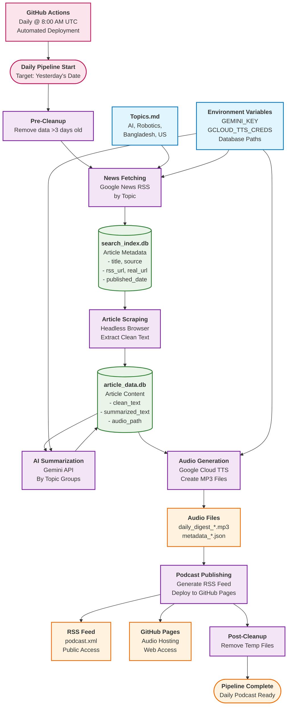

# Your Daily Podcaster

An automated podcast generation system that fetches news articles, summarizes them, and creates daily audio podcasts.

## Features

- **News Fetching**: Automatically fetches news articles from Google News RSS feeds
- **Article Scraping**: Extracts clean content from articles using headless browser
- **AI Summarization**: Uses Gemini API to create concise summaries by topic
- **Audio Generation**: Converts summaries to speech using Google Cloud TTS
- **Podcast Publishing**: Publishes to Spotify (planned)
- **Date-Based Processing**: Ensures only yesterday's articles are processed
- **Automatic Cleanup**: Maintains clean databases with configurable retention

## Workflow Overview

The following diagram shows how the complete podcast generation pipeline works:



## Date-Based Processing

The system is designed to process **only yesterday's articles** to ensure fresh, relevant content. This is enforced throughout the entire pipeline:

### How It Works

1. **News Fetching**: Only fetches articles published yesterday from Google News RSS feeds
2. **Article Processing**: Only processes articles from yesterday's date
3. **Summarization**: Only summarizes articles from yesterday
4. **Audio Generation**: Only generates audio for yesterday's summaries
5. **Automatic Cleanup**: Removes data older than 3 days to maintain performance

### Date Filtering

- **Default**: All modules default to yesterday's date
- **Override**: You can specify a different date using `--date YYYY-MM-DD`
- **Consistency**: The same date is used across all pipeline stages

### Cleanup Strategy

- **Retention**: Data is kept for 3 days by default
- **Automatic**: Cleanup runs automatically in the pipeline
- **Manual**: You can run cleanup manually using the data manager

## Installation

```bash
# Clone the repository
git clone https://github.com/nagsujosh/your-daily-podcaster
cd yourDailyPodcaster

# Create virtual environment
python -m venv venv
source venv/bin/activate  # On Windows: venv\Scripts\activate

# Install dependencies
pip install -r requirements.txt
```

## Configuration

1. Copy `.env.example` to `.env` and fill in your API keys:
   ```bash
   cp .env.example .env
   ```

2. Required environment variables:
   - `GEMINI_KEY`: Your Google Gemini API key
   - `GCLOUD_TTS_CREDS`: Path to Google Cloud service account credentials (optional)

3. Configure topics in `data/Topics.md`:
   ```markdown
   # Daily News Topics

   - Technology
   - Business
   - Science
   - Politics
   ```

## Usage

### Full Pipeline (Recommended)

Run the complete pipeline for yesterday's articles:

```bash
python -m yourdaily.run_pipeline
```

### Individual Modules

#### 1. Fetch News Articles
```bash
python -m yourdaily.scraper.fetch_search_results
```

#### 2. Scrape Article Content
```bash
python -m yourdaily.scraper.scrape_articles
# Or with specific date:
python -m yourdaily.scraper.scrape_articles --date 2024-01-15
```

#### 3. Summarize Articles
```bash
python -m yourdaily.summarizer.summarize_articles
# Or with specific date:
python -m yourdaily.summarizer.summarize_articles --date 2024-01-15
```

#### 4. Generate Audio
```bash
python -m yourdaily.tts.generate_audio
# Or with specific date:
python -m yourdaily.tts.generate_audio --date 2024-01-15
```

### Data Management

#### View Statistics
```bash
# Get stats for yesterday
python -m yourdaily.utils.data_manager --action stats --date 2024-01-15

# Get stats for date range
python -m yourdaily.utils.data_manager --action stats --start-date 2024-01-10 --end-date 2024-01-15

# Get overall database info
python -m yourdaily.utils.data_manager --action stats
```

#### Clean Data
```bash
# Clean data from specific date
python -m yourdaily.utils.data_manager --action clean --date 2024-01-10

# Clean data older than N days
python -m yourdaily.utils.data_manager --action clean --days 5

# Run maintenance (clean old data + get stats)
python -m yourdaily.utils.data_manager --action maintenance

# Prepare for yesterday processing
python -m yourdaily.utils.data_manager --action prepare
```

#### Manual Cleanup
```bash
python -m yourdaily.cleaner.cleanup
```

## Database Structure

### search_index.db
Stores article metadata from RSS feeds:
- `id`: Primary key
- `topic`: Article topic
- `title`: Article title
- `rss_url`: Original RSS URL
- `real_url`: Resolved article URL
- `source`: News source
- `rss_date`: RSS publication date
- `published_date`: Article publication date
- `inserted_at`: When added to database

### article_data.db
Stores processed article content:
- `id`: Primary key
- `rss_url`: Original RSS URL
- `real_url`: Resolved article URL
- `clean_text`: Extracted article content
- `summarized_text`: AI-generated summary
- `audio_path`: Generated audio file path
- `summarized_at`: When summary was created

## Date-Based Processing Details

### Why Yesterday Only?

1. **Fresh Content**: Ensures podcasts contain the most recent news
2. **Consistency**: All pipeline stages work on the same date
3. **Performance**: Prevents processing of old, irrelevant articles
4. **Storage**: Keeps database size manageable

### Date Enforcement

- **Fetching**: RSS feeds are filtered by publication date
- **Scraping**: Only processes articles from target date
- **Summarization**: Only summarizes articles from target date
- **Audio**: Only generates audio for target date summaries
- **Cleanup**: Automatically removes data older than 3 days

### Override Date

You can process articles from a different date:

```bash
# Process articles from a specific date
python -m yourdaily.run_pipeline --date 2024-01-15

# Or run individual modules with specific date
python -m yourdaily.scraper.scrape_articles --date 2024-01-15
python -m yourdaily.summarizer.summarize_articles --date 2024-01-15
python -m yourdaily.tts.generate_audio --date 2024-01-15
```

## Cleanup Strategy

### Automatic Cleanup

The pipeline includes automatic cleanup:
- **Pre-Cleanup**: Removes old data before processing
- **Post-Cleanup**: Removes temporary files after processing

### Manual Cleanup

Use the data manager for manual operations:
```bash
# Clean data older than 3 days
python -m yourdaily.utils.data_manager --action clean --days 3

# Clean data from specific date
python -m yourdaily.utils.data_manager --action clean --date 2024-01-10

# Run comprehensive maintenance
python -m yourdaily.utils.data_manager --action maintenance
```

### Retention Policy

- **Article Data**: 3 days (configurable)
- **Audio Files**: 7 days
- **Log Files**: 30 days
- **Temporary Files**: Removed immediately after processing

## Troubleshooting

### Common Issues

1. **No Articles Found**: Check if there are articles from yesterday in the database
2. **API Errors**: Verify your API keys are correct
3. **Audio Generation Fails**: Check Google Cloud TTS credentials
4. **Database Issues**: Run cleanup to remove corrupted data

### Debug Mode

Enable detailed logging:
```bash
export LOG_LEVEL=DEBUG
python -m yourdaily.run_pipeline
```

### Check Data Status

```bash
# Check yesterday's data
python -m yourdaily.utils.data_manager --action stats --date $(date -d yesterday +%Y-%m-%d)

# Check database health
python -m yourdaily.utils.data_manager --action maintenance
```

## Contributing

1. Fork the repository
2. Create a feature branch
3. Make your changes
4. Add tests if applicable
5. Submit a pull request

## License

This project is licensed under the MIT License - see the LICENSE file for details.
